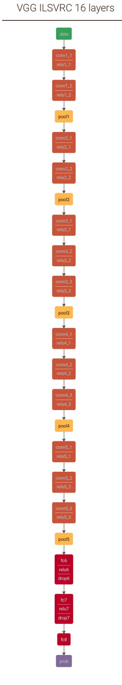
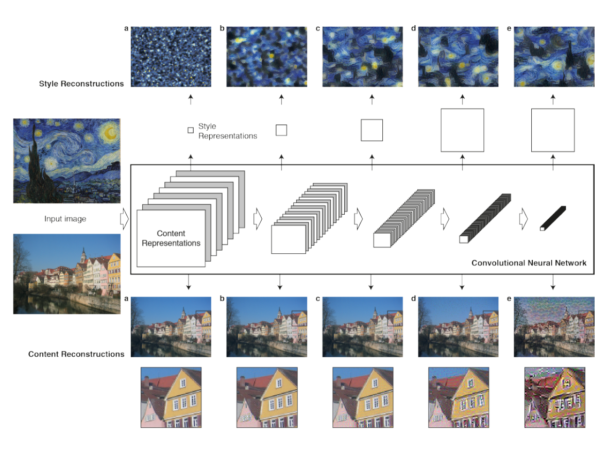
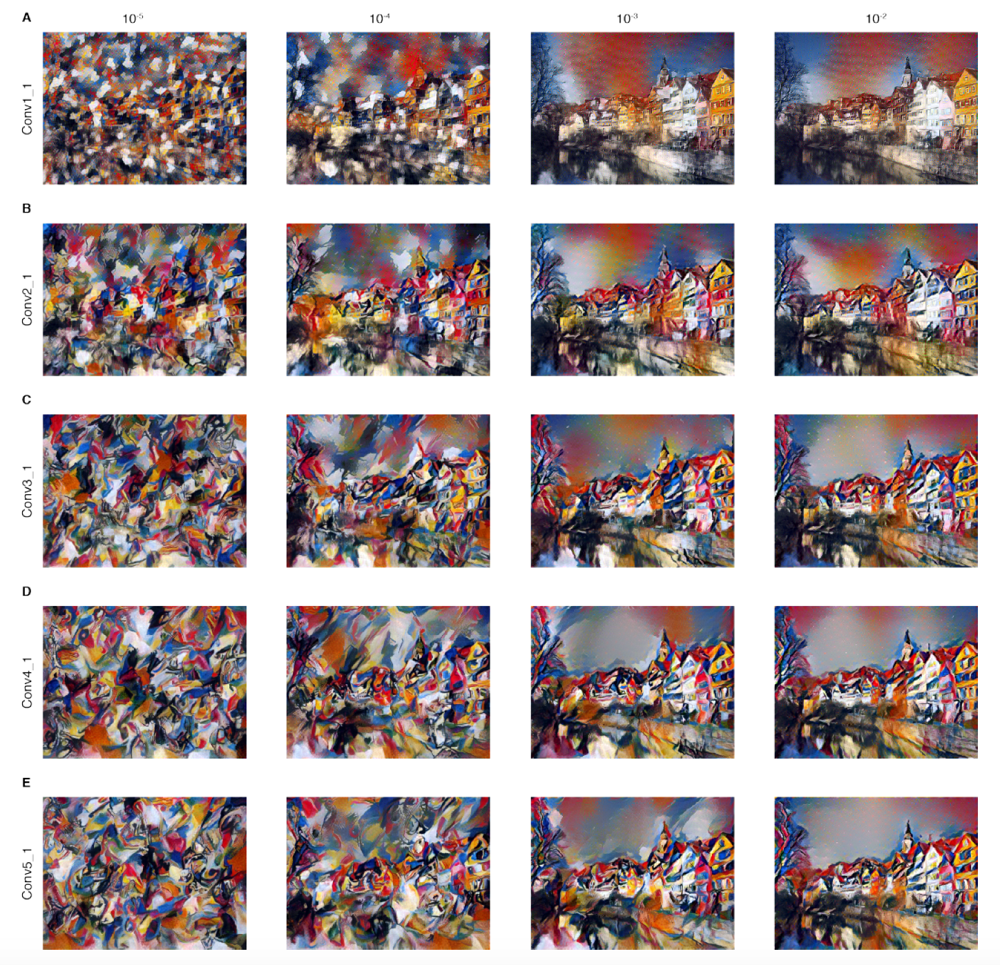
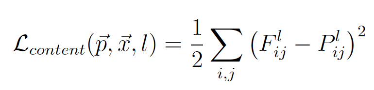
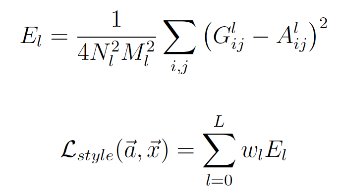
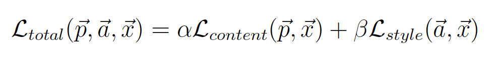

## 概述

在艺术领域，艺术家可以通过风格和内容的相互交融来创作不同的画作，现阶段，在深度神经网络的帮助下，计算机可以轻易的识别画作中的物体或者内容。但是，风格是一个比较抽样的概念，计算机其实无法像人类那样识别一个画作或者艺术家的风格。这篇文章主要介绍深度神经网络将画作中的风格和内容本身进行分离，并将风格做迁移，应用到另一个图片内容之中，最终达到一个风格迁移的工作。其实这很像Photoshop中的滤镜，然而滤镜毕竟是人为设定好的一系列动作处理集合，只能针对特定风格的图片，对于不同特征的图片，需要选择不同的滤镜，因此是比较机械和人工的。

卷积神经网络在图像识别领域应用广泛，并且实践证明有很好的效果。它通过一个多层的网络结构来对图像进行特征表达，如果我们把输入图像称之为网络的底层，则随着网络层次的加深，高层的网络关注图片的高级特征，例如图像的内容或者物体的排列，而底层的信息则重点关注图像像素级别的特征。为了将图像的风格和内容分离并进行迁移，我们需要做两部分工作：

- 图像内容的重建
- 风格的重建

同时在合成是要同时考虑内容重建造成的loss和风格重建造成的loss。

## 内容重建
内容重建和风格重建都使用了VGG网络，VGG-16的网络结构图参见下图，详情图来自于[这里](https://github.com/dmlc/mxnet/blob/master/example/image-classification/symbol_vgg.py).

<h7>图1 VGG网络结构图</h7>

 
对于内容重建来说，只使用了前5层的网络‘conv1 1’ (a), ‘conv2 1’ (b), ‘conv3 1’ (c), ‘conv4 1’ (d) and ‘conv5 1’ (e)，即图2中的a、b、c、d、e。VGG 网络主要用来做内容识别，在实践中作者发现，使用前三层a、b、c已经能够达到比较好的内容重建工作，d、e两层保留了一些比较高层的特征，丢失了一些细节。

<h7>图2 VGG网络结构图</h7>

## 风格重建

与内容重建有所区别的是，作者使用各个卷基层的组合来进行重建，具体使用的网络结构如下：
- ‘conv1_1’ (a)
- ‘conv1_1’ and ‘conv2_1’ (b)
- ‘conv1_1’, ‘conv2_1’ and ‘conv3_1’ (c)
- ‘conv1_1’, ‘conv2_1’, ‘conv3_1’ and ‘conv4_1’ (d)
- ‘conv1_1’, ‘conv2_1’, ‘conv3_1’, ‘conv4_1’
and ‘conv5_1’ (e)

这样构建的网络能够识别图像的风格信息，而忽略图像中的内容。

## 风格与内容的权衡

这篇文章的主要发现是我们可以通过CNN将图像的内容和风格进行分离，然后通过和其他图像内容、风格的重组来创作风格迁移的图像。

当然，风格和内容并不是完全可以分离开的，在图像的分离和重建时，我们要权衡更看重内容重建还是风格的重建，如果注重风格重建，则新生成的图像风格上会更符合我们的要求，但是内容上可能丢弃的内容比较多。同理，如果注重内容重建，则新的图像内容上是清晰可辨识的，但是风格上可能达不到我们的要求。图3是权衡风格和内容不同的比例得到的结果：

<h7>图3 VGG网络结构图</h7>

图3中，从第一列到第四列风格与内容的权重比例由高到低，第一列表示我们更看重风格，可以看到，我们看到的图像基本就是艺术风格，根本分不清建筑物，随着比例由高到低，建筑物逐渐变得清晰起来，第五列基本达到了我们想要的效果。

## Methods

实践中发现，使用average pooling比max pooling效果要好一点。具体来说，对于内容重建和风格重建，分别构建Loss。对于内容重建来说，利用一张白噪音图片去拟合原始图像中的内容，定义Loss为：

<h7>公式1</h7>

其中F为白噪音图像在L层的数据表示，P为原始数据在L层的表示，Loss为square loss。

对于风格重建，和Content Loss类似，不过如之前讨论，最后的Loss是之前各层的Loss之和。

<h7>公式2</h7>

其中G为白噪音图像在L层的数据表示，A为原始数据在L层的表示。

最后，为了将图像风格和内容进行迁移，我们定义最后的Loss为Content loss 和 style loss之和，权重分别为alpha何beta，如公式3所示：

<h7>公式3</h7>

